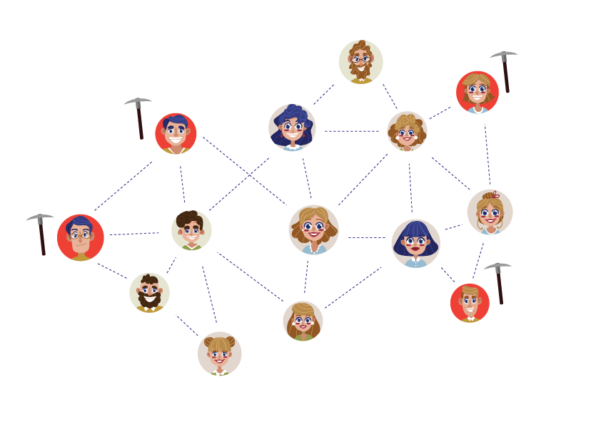
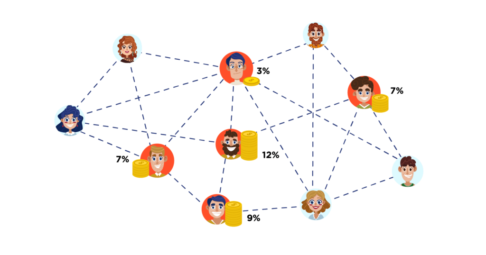
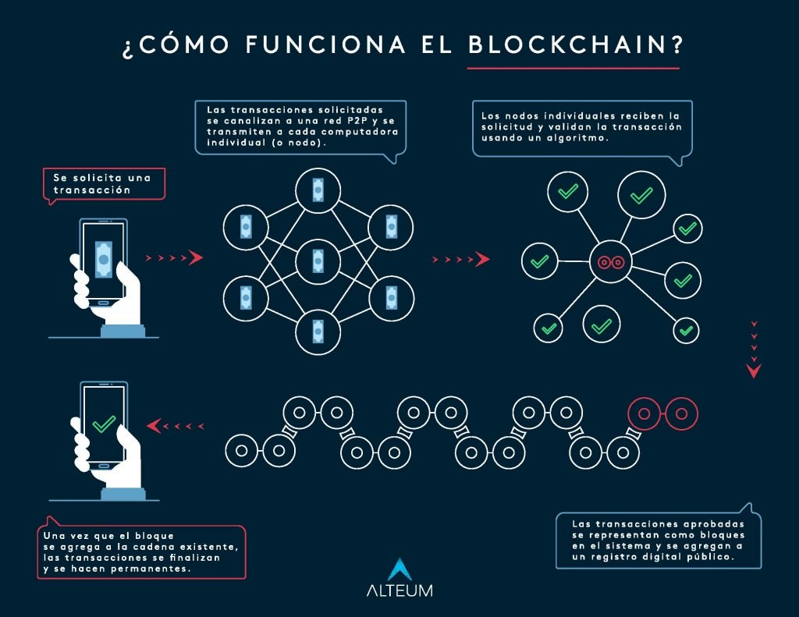
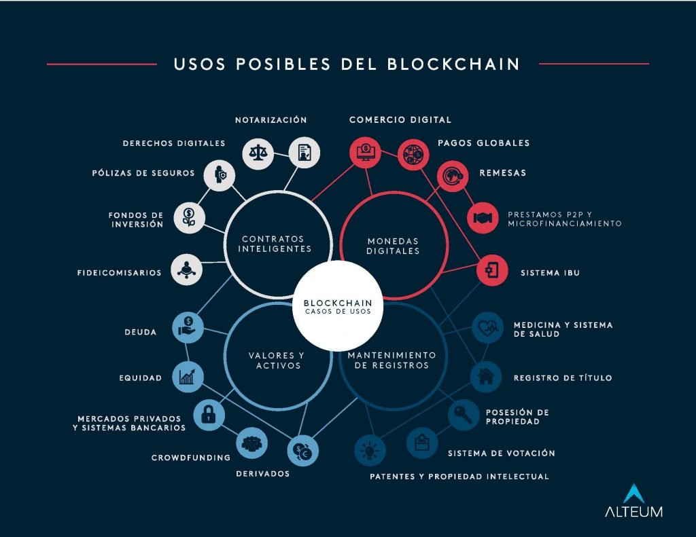

# INTRODUCCIÓN A BLOCKCHAIN

Blockchains es una tecnología con un significado hasta cierto punto indeterminado por lo que su defición puede variar dependiendo su uso, por lo tanto se ha de hacer uso de analogías para brindar una mejor comprensión acerca del tema en sí.
Se presentarán aspectos importantes en los cuales se compone este principio tecnológico ambisioso, se apreciaran las razones por la cual es un concepto tan buscado por muchas compañías y otras entidades , además de ser una apuesta que servirá como base para la creación de futuras tecnologías que revolucionarán el mundo digital.

#### BLOCKCHAINS

Un conjuto de definición acerca de esta tecnología podría ser la siguiente, Blockchains es una **red** codificada de transferencia P2P(peer-to-peer) no centralizada, que funciona a traves de un conjunto de tecnologias que **permite tranferir de manera mas segura los datos** y que esta basada en bloques o nodos descentralizados de registros enlazados y cifrados.

La mayoría de las blockchains están diseñadas como un **libro digital distribuido y descentralizado**. En términos simples, blockchain es un libro digital que es básicamente una versión electrónica de un libro mayor de papel, y es responsable de registrar una lista de transacciones.

El concepto de lo que Blockchains es puede ser un tanto variable, esto se debe al alcance que esta tecnologia esta demostrando tener.

Se debe partir de conceptos básicos para que se cree una comprensión mas estructurada del tema:

- **Blockchain**: Se puede traducir como cadena de bloques, en donde cada bloque contiene información valiosa y que no requiere de ninguna entidad central para su supervisión. Ésta se apoya en varios algoritmos criptográficos para obtener el nivel de seguridad.

    En cada bloque de esta cadena se almacena lo siguente:
    1. Una cantidad de registros o transacciones válidas.
    2. Información referente a ese bloque.
    3. Su vinculación con el bloque anterior y el siguiente a través del hash de cada bloque, que sería como la huella digital de ese bloque.

- **Descentralizada**: Significa que la información no se encuentra en ningún ordenador en particular, como lo son los servidores que hospedan sitios web, sino que hay copias diseminadas en varios ordenadores de la red, también llamados **nodos.**

- **Mecanismo de consenso**: Los mecanismos de consenso son los que permiten validar qué información es agregada o no al blockchain. Es un componente muy importante en la desentralización.

- **Mineros**: Se llama mineros a las personas que ofrecen el poder de cómputo de sus ordenadores para verificar los bloques, a cambio reciben una recompensa en la criptomoneda nativa de ese blockchain.

- **Mineria de datos**: En general, la minería de datos (a veces llamada descubrimiento de datos o de conocimiento) es el proceso de analizar los datos desde diferentes perspectivas y resumiéndolos en información útil.

- **Clave Privada**: Que en realidad es un número secreto conocido solo por la persona que lo generó.Una clave privada es una mezcla de números y letras generado “aleatoriamente”.En Bitcoin, alguien con la clave privada corresponde a los fondos en la blockchain es el único que puede gastar esos fondos.

- **Clave Pública**:Es el número generado a partir de una relación matemática usando la clave privada.Solo se puede obtener cnociendo la clave privada con anterioridad, y no al revés.Esta clave se genera con el fin de compartirse públicamente para que otros puedan determinar si una firma es genuina.

- **Firma**:Es un número que prueba que se realizó una operación de firma.Una firma se genera matemáticamente a partir de un hash de algo que se firmará, más una clave privada.

#### CIFRADOS DE SEGURIDAD

De acuerdo al funcionamiento y comportamiento de Blockchain se puede llegar a apreciar un **Sistema de Cifrado Asimétrico**.
Pero qué quiere decir esto?
El Cifrado asimétrico también es conocido como **clave pública**, emplea dos llaves diferentes en cada uno de los extremos de la comunicación. Cada usuario tendrá una clave **pública** y otra **privada**. La clave privada tendrá que ser protegida y guardada por el propio usuario, será secreta y no la deberá conocer nadie. La clave pública será accesible a todos los usuarios del sistema de comunicación.

#### QUE TIENEN QUE VER LOS MECANISMOS DE CONSENSO CON BLOCKCHAIN?

Pues bien, las cadenas de bloques no son desentralizadas por defecto, por eso es que se requiere de protocolos o mecanismos de consenso.
La palabra consenso indica que es una forma de llegar a un acuerdo. En un sistema descentralizado donde no exista un consenso común éste acabará por desaparecer. NO importa si los participantes se tienen confianza o no. Todos ellos necesitan llegar a un acuerdo de ciertos principios y funcionalidades que serán comunes para todos los involucrados. Y ese es el rol del mecanismo de consenso. 
Antes de pasar a ver cómo intervienen los algoritmos de consenso más populares es importante comprender que:
1. No existe hasta ahora un método para alcanzar consenso de forma universal.
2. Tampoco existe un algoritmo que sea mejor que otro, simplemente aquellos que encajan mejor con lo que se busca hacer.

##### Tipos de Algoritmo de Consenso

* **Prueba de Trabajo(PoW)**
Como su nombre lo puede indicar consiste en demostrar que se ha realizado una tarea para que la transacción sea verificada y validada. Esto puede preveer que el sistema sea atacado por votantes falsos, cuantos más trabajos realices mayor será la posibilidad de proponer el próximo bloque y obtener una recompensa.

* **Prueba de Participación(PoS)**
Este es muy parecido a la votación que se da entre los accionistas de una empresa, donde el que tenga mayor cantidad de acciones tiene mayor autoridad, por lo que no se trata de la cantidad de votantes sino del peso que éstos tienen.
Dado que aquellos usuarios que tengan una mayor cantidad de monedas o participaciones, tienen el mayor incentivo para hacer que el blockchain funcione de forma correcta, además esta forma de consenso logra que la red se mantenga segura y motive a los validadores a ser honestos.

* **Acuerdo Bizantino Federado (FBA)**
Este mecanismo permite alcanzar consenso entre un gran número de participantes, cuyo total se desconoce.
Cada participante elige confiar en un limitado número de personas,grupos de otros participantes, formando lo que se conoce como circulo de confianza en donde se alcanza fácilmente el consenso.
Eventualmente cada participante puede elegir confiar en alguien, que a su vez confía en alguien más, permitiendo que se genere confianza de forma indirecta.

#### ALGORÍTMOS CRIPTOGRÁFICOS USADOS EN BLOCKCHAIN

* **ECDSA**: Elliptic Curve Digital Signature Algorithm ó Algoritmo de Curva Elíptica para el firmado Digital. Este algortimo funciona mediante un mecanismo de criptografía llamado **criptogragía asimétrica**. Este sistema de firmado , genera dos claves que reciben el nombre de **clave privada y clave pública**. Ambas claves están relacionadas por una compleja operación matemática realizada sobre una función de curva elíptica.
Bajo este esquema de funcionamiento, ECDSA garantiza en primera instancia lo siguiente:
    1. Firmas únicas e irrepetibles par acada conjunto de generación de claves privadas y públicas.
    2. La imposibilidad práctica de falsificar las firmas digitales.

* **SHA-256**: Es un algoritmo de hash diseñado por la NSA. Es usado para transformar en un solo sentido una cantidad de información en una cadena criptográfica segura.
Se dice que es “de un solo sentido” porque cada hash es obtenido de una información previa conocida , y dicha información no puede ser obtenida con un proceso inverso sobre el hash generado.
El algoritmo SHA-256 es usado en diferentes partes en una blockchain:
    1. Para el proceso de minado, se utiliza SHA-256 como el algoritmo de prueba de trabajo.
    2. Se utiliza para brindar direcciones públicas seguras, partiendo de la clave pública ECDSA generada.

* **ETHASH**: También conocido como DaggerHashimoto, es un algoritmo de hash creado por los desarrolladores de Ethereum. Su objetivo más prominente es ser resistentes a los ASIC, prefiriendo acomodar la minería basada en GPU.
ASIC es el acrónimo de Circuitos Integrados Asimétricos Específicos (Asymmetric Integrated Specific Circuit), y son chips diseñados para hacer eficientemente una tarea en específico, pero la razón por la que en este caso pueden ser un problema es porque se atenta en cierta forma contra la descentralización de las blockchain.

* **CRYPTONIGHT**: Es un algoritmo de prueba de trabajo que fue dseñado para ser compatible con el CPU de una PC convencional. Una caracteristica importante de CryptoNight es que es más difícil aumentar el poder de minería utilizando dispositivos ASIC.

#### COMO FUNCIONA BLOCKCHAIN
1. Un **nodo** inicia una transacción creando firma con una llave privada. Una transacción puede representar varias acciones en la cadena de bloques. Por lo general son estructuras de datos que reprensentan la transferencia de valor entre usuarios de la red de cadenas de bloques.
El primer bloque en una cadena de bloques es conocido como **Bloque Génesis**.

2. La transacción es propagada por la red de usuarios de la cadena de bloques usando un protocolo conocido como Gossip. El cual consiste en propagar información a los usuarios con comunicación peer-to-peer. Normalmente es requerida la verificación por más de un nodo.

3. Una vez que la transacción ha sido verificada es incluída en un bloque y posteriormente propagada por toda la red. En este punto la transacción es considerada confirmada.

4. Ahora el bloque recién creado forma parte del “libro mayor” y el siguiente bloque será enlazado con éste por medio de un “apuntador” a un hash.

5. Una transacción es reconfirmada cada vez que se crea un nuevo bloque. Por lo general seis confirmaciones son requeridas para considerar finalizada la transacción.

##### PROBLEMAS QUE NOS AYUDA A RESOLVER Y ÁREAS DE USO DE BLOCKCHAIN 
* **Criptomonedas**:
La criptomoneda resuelve una gran cantidad de problemas, y depende de su implementación. 
    * Beneficios en caso de uso en criptomonedas:
        * Actuar como moneda.
        * Utilizado como combustible en algunas cadenas de bloques.
        * Facilita las transacciones entre pares.
        * Elimina a los intermediarios.
        * Da una opción a quienes no tienen acceso a servicios bancarios.

* **Votación**:
Ha habido muchas controversias sobre la manipulación del voto en diferentes países entre los partidos gobernantes. Además, los votos falsos y otras actividades pueden ser una preocupación para el proceso de votación de cualquier estado.   
    * Beneficios de los casos de uso de la tecnología Blockchain de votación 

        * Eliminación del fraude electoral
        * La votación remota es posible
        * Votos verificables e inmutables
        * Blockchain como la forma segura de almacenar votos
        * Confianza y transparencia mejoradas.

* **Notariado**:
El notariado es uno de los mejores casos de uso de blockchain. El sistema heredado depende en gran medida del papeleo. Eso significa que los registros se mantienen en forma impresa, que son susceptibles a cambios y manipulación por parte de un tercero o partes maliciosas internas.
    * Beneficios de los casos de uso de la tecnología Notary Blockchain 
        * Elimina la necesidad de confianza.
        * Descentralizado.
        * Proporciona prueba de existencia.
        * 100% exacto.
        * Mejora la velocidad y el costo.

##### Áreas de Uso de Blockchain

####  VENTAJAS Y DESVENTAJAS DE BLOCKCHAIN

##### Ventajas
1. **Naturaleza Distribuida**
Dado que los datos de una blockchain se almacenan a menudo en miles de dispositivos en una red distribuida de nodos, el sistema y los datos son altamente resistentes a fallos técnicos y ataques maliciosos. Cada nodo de la red es capaz de replicar y almacenar una copia de la base de datos y, como resultado de esto, no hay un “single point of failure” (punto único de fallo): un único nodo que se desconecta no afecta a la disponibilidad o seguridad de la red.
En cambio, muchas bases de datos convencionales dependen de un servidor o unos pocos, y son más vulnerables a los fallos técnicos o ciberataques.

2. **Estabilidad**
    Es muy improbable que los bloques confirmados sean revertidos, lo que significa que una vez los datos han sido registrados en la blockchain, es extremadamente difícil eliminarlos o cambiarlos. Esto hace que la tecnología blockchain sea ideal para el almacenamiento de registros financieros o cualquier otro tipo de datos que requieren pistas de auditoría, debido a que todos los cambios son rastreados y permanentemente registrados en un libro contable (ledger) distribuido y público.
    

##### Desventajas

1. **Ataques del 51%**
El algoritmo de consenso Proof of Work que protege la blockchain de Bitcoin ha demostrado ser, a lo largo de los años, muy eficiente. Sin embargo, existen algunos tipos de ataques potenciales que pueden ser llevados a cabo contra redes blockchain -siendo los del 51% unos de los más debatidos. Un ataque de este tipo puede tener lugar si una entidad logra hacerse con el control de más del 50% del hashing power (o tasa de hash) de la red, lo que eventualmente podría permitirle desorganizar la red mediante la exclusión o modificación intencionada del orden de las transacciones.
A pesar de ser posible desde un punto de vista teórico, nunca se ha producido un ataque del 51% que haya tenido éxito en la blockchain de Bitcoin. 

2. **Ineficiente**
Las blockchains, especialmente aquellas que usan Proof of Work, son altamente ineficientes. Dado que el minado es muy competitivo y sólo hay una ganador cada diez minutos, el trabajo del resto de mineros habrá sido desperdiciado. Debido a que los mineros intentan constantemente aumentar su potencia computacional para así tener mayores probabilidades de encontrar el hash de un bloque válido, se ha producido en los últimos años un incremento notable de los recursos empleados por la red Bitcoin.

#### CONCLUSIÓN

A pesar de las desventajas, la tecnología blockchain presenta algunas ventajas únicas; y podemos afirmar que, definitivamente, está aquí para quedarse.
En los próximos años, es probable que veamos cómo empresas y gobiernos experimentan con nuevas aplicaciones, con el objetivo de descubrir el lugar en el que la tecnología blockchain añade más valor.

Palabras clave la la comprensión de Blockchain:
- Cifrado Asimetrico
- Nodos
- Descentralización
- Algoritmos de Consenso
- Minería de Datos

#### BIBLIOGRAFÍA

Conceptos de Blockchain:
* <https://josefacchin.com/blockchain-que-es/>
* <https://www.binance.vision/es/blockchain/difference-between-blockchain-and-bitcoin>
* <https://blockgeeks.com/guides/es/que-es-la-tecnologia-de-cadena-de-bloques-una-guia-paso-a-paso-para-principiantes>
* <https://criptotario.com/como-ser-un-desarrollador-blockchain>
* <https://medium.com/coinmonks/what-the-hell-is-blockchain-and-how-does-it-works-simplified-b9372ecc26ef>

Algoritmos criptográficos usados en blockchain:
* <https://www.criptotendencias.com/base-de-conocimiento/eli5-algoritmos-criptograficos-en-la-blockchain/>

Algoritmos de Cifrado Asimétrico:
* <https://www.redeszone.net/2010/11/16/criptografia-algoritmos-de-cifrado-de-clave-asimetrica/>

Comprendiendo la minería de datos:

* <https://www.tecnologias-informacion.com/mineria-de-datos.html>

Algoritmos de Consenso en Blockchain:

* <https://criptotario.com/que-es-un-algoritmo-de-consenso-en-blockchain>

Ventajas y Desventajas de Blockchain:

* <https://www.binance.vision/es/blockchain/positives-and-negatives-of-blockchain>

Comprendiendo ECDSA:

* <https://academy.bit2me.com/que-es-ecdsa-curva-eliptica/>

* <https://kjur.github.io/jsrsasign/sample/sample-ecdsa.html>

Casos de Uso de Blockchain:

* <https://101blockchains.com/es/uso-de-blockchain/>